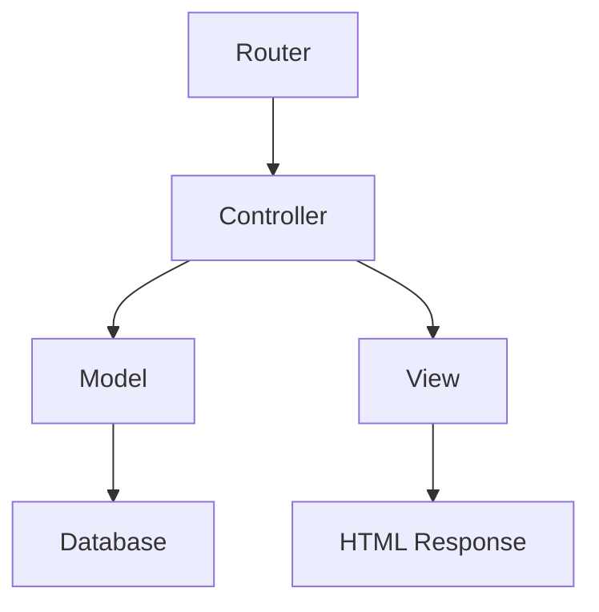

# MackAI - Plataforma Unificada (OP-3)

## 🎯 Visão Geral

O **OP-3** é a evolução natural dos projetos MackAI, combinando o melhor de dois mundos:

- **🏗️ Stack Robusta** do OP-2 (PHP + MySQL + Google Cloud)
- **🎨 Design Moderno** do OP-1 (Interface responsiva e atrativa)
- **🔗 Funcionalidades Integradas** (Site institucional + Plataforma de encontros)

Esta versão unificada oferece uma experiência completa para a Liga Acadêmica de Ciência de Dados e IA da UPM.

## 🚀 Funcionalidades

### ✅ Site Institucional
- Página inicial com estatísticas em tempo real
- Seção sobre a liga e áreas de atuação
- Portfólio de projetos e apresentações
- Formulário de contato funcional

### ✅ Plataforma de Encontros
- Listagem de encontros por grupo e período
- Player integrado do YouTube
- Sistema de filtros avançados
- Navegação intuitiva entre encontros

### ✅ Recursos Técnicos
- Design responsivo (mobile-first)
- Acessibilidade (WCAG 2.1 AA)
- SEO otimizado
- Performance otimizada
- Deploy automatizado na GCP

## 🛠️ Tecnologias

| Categoria | Tecnologia |
|-----------|------------|
| **Backend** | PHP 8.3 |
| **Banco de Dados** | MySQL 8.0 |
| **Frontend** | HTML5, CSS3, JavaScript (Vanilla) |
| **Cloud** | Google Cloud Platform |
| **Deploy** | Cloud Run + Cloud SQL |
| **Containerização** | Docker |

## 📁 Estrutura do Projeto

```
plataforma-mackai/
├── 📁 public/                 # Arquivos públicos
│   ├── 🚪 index.php          # Ponto de entrada (Router)
│   ├── 📁 assets/            # CSS, JS, imagens
│   │   ├── 📁 css/           # Estilos
│   │   │   └── main.css      # CSS principal
│   │   └── 📁 js/            # JavaScript
│   │       └── main.js       # JS principal
│   └── ⚙️ .htaccess          # Configurações Apache
├── 📁 src/                   # Código fonte
│   ├── 📁 controllers/       # Controladores MVC
│   │   ├── BaseController.php
│   │   ├── HomeController.php
│   │   ├── MeetingsController.php
│   │   ├── AboutController.php
│   │   ├── PortfolioController.php
│   │   └── ContactController.php
│   ├── 📁 models/           # Modelos de dados
│   │   ├── BaseModel.php
│   │   ├── Group.php
│   │   ├── Meeting.php
│   │   └── Period.php
│   ├── 📁 views/            # Templates PHP
│   │   ├── 📁 layout/       # Layout base
│   │   │   └── base.php
│   │   ├── 📁 home/         # Página inicial
│   │   │   └── index.php
│   │   └── 📁 meetings/     # Encontros
│   │       ├── index.php
│   │       └── show.php
│   └── 📁 config/           # Configurações
│       ├── database.php     # Config do banco
│       └── routes.php       # Rotas da aplicação
├── 📁 database/             # Scripts SQL
│   ├── 📄 schema.sql        # Estrutura do banco
│   └── 📄 seeds.sql         # Dados iniciais
├── 📁 docker/               # Deploy e containerização
│   ├── 🐳 Dockerfile        # Imagem Docker
│   └── ☁️ cloudbuild.yaml   # Build automático GCP
├── 📁 docs/                 # Documentação
│   ├── 📖 development.md    # Guia de desenvolvimento
│   └── 🚀 deployment.md     # Guia de deploy
├── 📄 .env.example          # Exemplo de variáveis de ambiente
├── 📄 .env                  # Configurações locais (não versionado)
├── 📄 .gitignore            # Arquivos ignorados pelo Git
└── 📄 README.md             # Este arquivo
```

## ⚡ Início Rápido

### 🔧 Desenvolvimento Local (Windows)

#### **Pré-requisitos**
- Windows 10/11
- Privilégios de administrador

#### **1. Instalar XAMPP**
1. Baixe o XAMPP: https://www.apachefriends.org/
2. Execute o instalador como administrador
3. Selecione: Apache, MySQL, PHP, phpMyAdmin
4. Instale na pasta padrão `C:\xampp`

#### **2. Clone o repositório**
```bash
git clone https://github.com/hevertonvalerio/plataforma-mackai.git
cd plataforma-mackai
```

#### **3. Iniciar serviços**
1. Abra o **XAMPP Control Panel** como administrador
2. Clique em **Start** ao lado de **Apache** e **MySQL**
3. Aguarde os status ficarem verdes

#### **4. Configurar banco de dados**
```bash
# Criar banco de dados
C:\xampp\mysql\bin\mysql.exe -u root -e "CREATE DATABASE mackai CHARACTER SET utf8mb4 COLLATE utf8mb4_unicode_ci;"

# Importar estrutura
Get-Content database\schema.sql | C:\xampp\mysql\bin\mysql.exe -u root mackai

# Importar dados iniciais
Get-Content database\seeds.sql | C:\xampp\mysql\bin\mysql.exe -u root mackai
```

#### **5. Configurar ambiente**
```bash
# Copiar arquivo de configuração
copy .env.example .env
# O arquivo .env já está configurado corretamente para desenvolvimento local
```

#### **6. Executar aplicação**
```bash
# Opção A: Servidor PHP built-in
C:\xampp\php\php.exe -S localhost:8080 -t public

# Opção B: Via Apache (copie projeto para C:\xampp\htdocs\)
# Acesse: http://localhost/plataforma-mackai/public
```

#### **7. Acessar aplicação**
```
http://localhost:8080
```

### 🐛 Solução de Problemas

#### **❌ "php não é reconhecido"**
Use o caminho completo: `C:\xampp\php\php.exe`

#### **❌ "mysql não é reconhecido"**
Use: `C:\xampp\mysql\bin\mysql.exe`

#### **❌ Erro de conexão com banco**
- Verifique se MySQL está rodando no XAMPP Control Panel
- Confirme que o banco `mackai` foi criado

#### **❌ Porta 8080 ocupada**
Mude para outra porta: `C:\xampp\php\php.exe -S localhost:8081 -t public`

### 🔧 Desenvolvimento Linux/Mac

1. **Instalar dependências**
```bash
# Ubuntu/Debian
sudo apt update
sudo apt install php mysql-server

# macOS (com Homebrew)
brew install php mysql
```

2. **Clone e configure**
```bash
git clone https://github.com/hevertonvalerio/plataforma-mackai.git
cd plataforma-mackai
cp .env.example .env
```

3. **Configurar banco**
```bash
mysql -u root -p -e "CREATE DATABASE mackai CHARACTER SET utf8mb4 COLLATE utf8mb4_unicode_ci;"
mysql -u root -p mackai < database/schema.sql
mysql -u root -p mackai < database/seeds.sql
```

4. **Executar**
```bash
php -S localhost:8080 -t public
```

### 🐳 Com Docker

```bash
# Build da imagem
docker build -f docker/Dockerfile -t mackai-op3 .

# Executar container
docker run -p 8080:8080 \
  -e DB_HOST=seu_host \
  -e DB_NAME=mackai \
  -e DB_USER=seu_usuario \
  -e DB_PASS=sua_senha \
  mackai-op3
```

## 🌐 Deploy na GCP

### Deploy Automático

```bash
# Configurar projeto
gcloud config set project mackai-468422

# Submit build
gcloud builds submit --config=docker/cloudbuild.yaml .
```

### Deploy Manual

```bash
# Build e push da imagem
docker build -f docker/Dockerfile -t gcr.io/mackai-468422/mackai-op3 .
docker push gcr.io/mackai-468422/mackai-op3

# Deploy no Cloud Run
gcloud run deploy mackai-op3 \
  --image gcr.io/mackai-468422/mackai-op3 \
  --region us-central1 \
  --allow-unauthenticated
```

📖 **Consulte** [`docs/deployment.md`](docs/deployment.md) **para instruções detalhadas**

## 🏗️ Arquitetura

### Padrão MVC Simplificado



### Fluxo de Requisição

1. **Router** (`public/index.php`) recebe a requisição
2. **Controller** processa a lógica de negócio
3. **Model** interage com o banco de dados
4. **View** renderiza a resposta HTML
5. **Layout** aplica o template base

## 🎨 Design System

### Cores Principais

| Cor | Hex | Uso |
|-----|-----|-----|
| 🔴 Vermelho Mackenzie | `#CE2029` | Primária |
| ⚫ Cinza Escuro | `#343a40` | Texto |
| ⚪ Branco | `#ffffff` | Fundo |
| 🔵 Azul | `#2E86AB` | Secundária |

### Tipografia

- **Fonte Principal**: Segoe UI, system-ui
- **Tamanho Base**: 16px
- **Linha Base**: 1.6

### Breakpoints

- **Mobile**: < 768px
- **Tablet**: 768px - 1024px
- **Desktop**: > 1024px

## 🔒 Segurança

### Medidas Implementadas

- ✅ Prepared Statements (SQL Injection)
- ✅ Input Sanitization (XSS)
- ✅ CSRF Protection
- ✅ Security Headers
- ✅ HTTPS Obrigatório
- ✅ Rate Limiting

### Headers de Segurança

```http
X-Frame-Options: DENY
X-Content-Type-Options: nosniff
X-XSS-Protection: 1; mode=block
Referrer-Policy: strict-origin-when-cross-origin
Content-Security-Policy: default-src 'self'
```

## 📊 Performance

### Otimizações

- ✅ Lazy Loading de imagens
- ✅ Compressão GZIP
- ✅ Cache de assets
- ✅ Minificação CSS/JS
- ✅ Otimização de queries

### Métricas Alvo

- **First Contentful Paint**: < 2s
- **Largest Contentful Paint**: < 3s
- **Cumulative Layout Shift**: < 0.1
- **First Input Delay**: < 100ms

## ♿ Acessibilidade

### Conformidade WCAG 2.1 AA

- ✅ Navegação por teclado
- ✅ Screen reader friendly
- ✅ Contraste adequado (4.5:1)
- ✅ ARIA labels
- ✅ Foco visível
- ✅ Texto alternativo

## 🧪 Testes

### Checklist de Qualidade

- [ ] Funcionalidade básica
- [ ] Responsividade
- [ ] Acessibilidade
- [ ] Performance
- [ ] Segurança
- [ ] SEO

### Ferramentas Recomendadas

- **Lighthouse** (Performance/SEO)
- **axe DevTools** (Acessibilidade)
- **WAVE** (Acessibilidade)
- **GTmetrix** (Performance)

## 📚 Documentação

| Documento | Descrição |
|-----------|-----------|
| [`docs/development.md`](docs/development.md) | Guia de desenvolvimento |
| [`docs/deployment.md`](docs/deployment.md) | Guia de deploy |
| [`database/schema.sql`](database/schema.sql) | Estrutura do banco |
| [`.env.example`](.env.example) | Variáveis de ambiente |

## 🤝 Contribuição

### Como Contribuir

1. **Fork** o repositório
2. **Crie** uma branch (`git checkout -b feature/nova-funcionalidade`)
3. **Commit** suas mudanças (`git commit -am 'Adiciona nova funcionalidade'`)
4. **Push** para a branch (`git push origin feature/nova-funcionalidade`)
5. **Abra** um Pull Request

### Padrões de Código

- **PHP**: PSR-12
- **CSS**: BEM methodology
- **JavaScript**: ES6+
- **Commits**: Conventional Commits

## 📄 Licença

Este projeto está sob a licença MIT. Veja o arquivo [LICENSE](LICENSE) para mais detalhes.

## 👥 Equipe

**Liga MackAI** - Liga Acadêmica de Ciência de Dados e IA  
🏫 Universidade Presbiteriana Mackenzie  
📧 contato@mackai.com.br  

---

<div align="center">

**Desenvolvido com ❤️ pela Liga MackAI**

[🌐 Site](https://mackai.com.br) • [📧 Contato](mailto:contato@mackai.com.br) • [📱 Instagram](https://instagram.com/mackai) • [💼 LinkedIn](https://linkedin.com/company/mackai)

</div>
